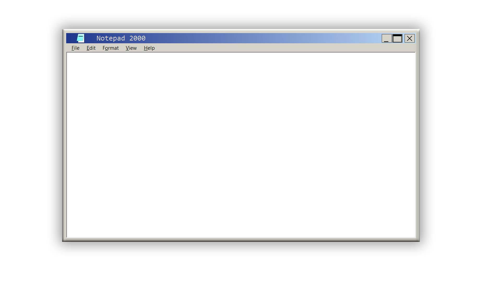
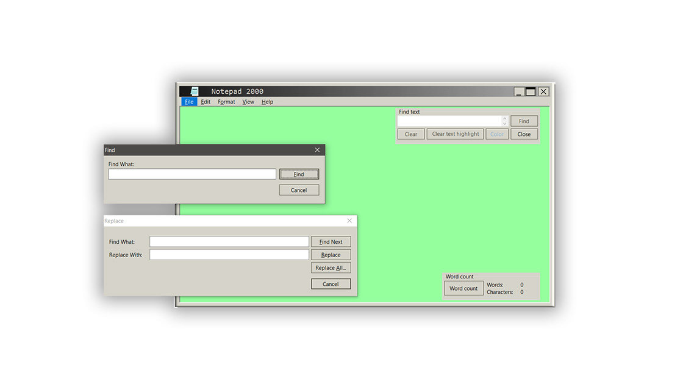
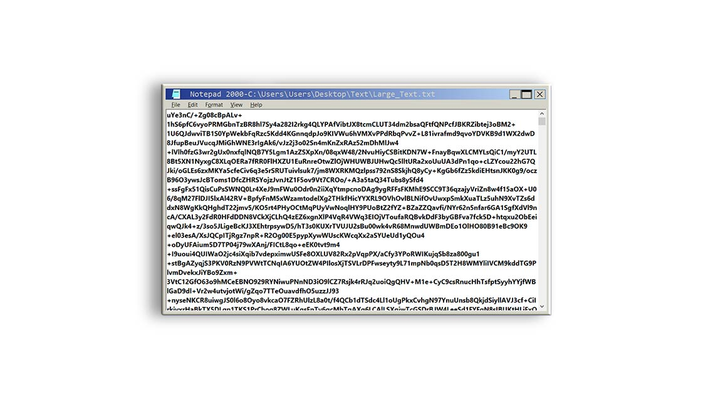

# Notepad

Version 2019 (Build 6.2.4) C#

A Notepad with a look of Windows 2000

<h2>Made simple to use and powerful</h2> 

 

 <h2> Multifunctional and user friendly </h2> 

 <h2> More options available than you can imagine </h2> 

 <h2> High Encryption </h2> 

 <h2> What's new: </h2> 

- 
In the version 6.2.4 added:

- - 
New Encryption confirm

- 
In the version 6.2.3 added:

- - 
New Encryption / Decryption method with password

- - 
Bugs fixed

- - 
Changed theme buttons

 <h2> Info: </h2> 

- 
Name of the project: "Notepad 2000"

- 
Current version: 2019 (Build 6.2.4) 

- 
C-Sharp

- 
Created in Visual Studio 2019 

- 
<a href="https://www.microsoft.com/en-us/download/details.aspx?id=21">Net.Framework 3.5</a> 

- 
Other Framework you may need: <a href="https://github.com/sobatdata/Guna.UI-Framework-Lib.git">Guna</a> 

- 
Size of the project: 29.1 MB (30,593,856 bytes) 

<h2>license:</h2>

Author: Bill Chamalidis

Copyright (c). All rights Reserved

This program is free software: you can redistribute it and/or modify
    it under the terms of the <a href="https://www.gnu.org/licenses/gpl-3.0.en.html">GNU</a> General Public License as published by
    the Free Software Foundation, either version 3 of the License, or
    any later version.

