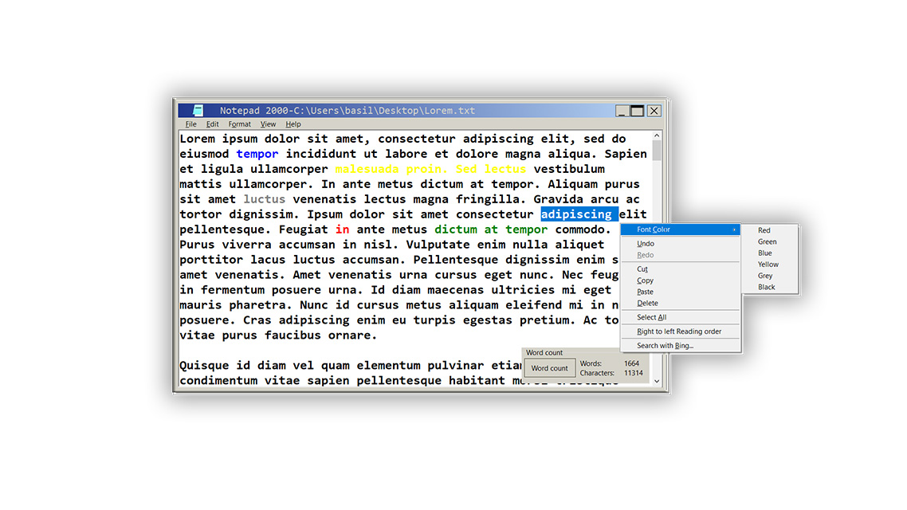

# Notepad
Version 2019 (Build 6.2.2)

A Notepad with a look of Windows 2000

<h2>Made simble to use and powerful</h2> 

 

 <h2> Multifunctional and user friendly </h2> 

 <h2> More options available than you can imagine </h2> 

 <h2> Info: </h2> 

Name of the project: "Notepad 2000"

Current version: 2019 6.2.2 

C-Sharp

Created in Visual Studio 2019 

<a href="https://www.microsoft.com/en-us/download/details.aspx?id=21">Net.Framework 3.5</a> 

other Framework you may need: <a href="https://github.com/sobatdata/Guna.UI-Framework-Lib.git">Guna</a> 

Size of the project: 29.1 MB (30,593,856 bytes) 

Author Bill Chamalidis

Copyright (GNU). All rights Reserved

